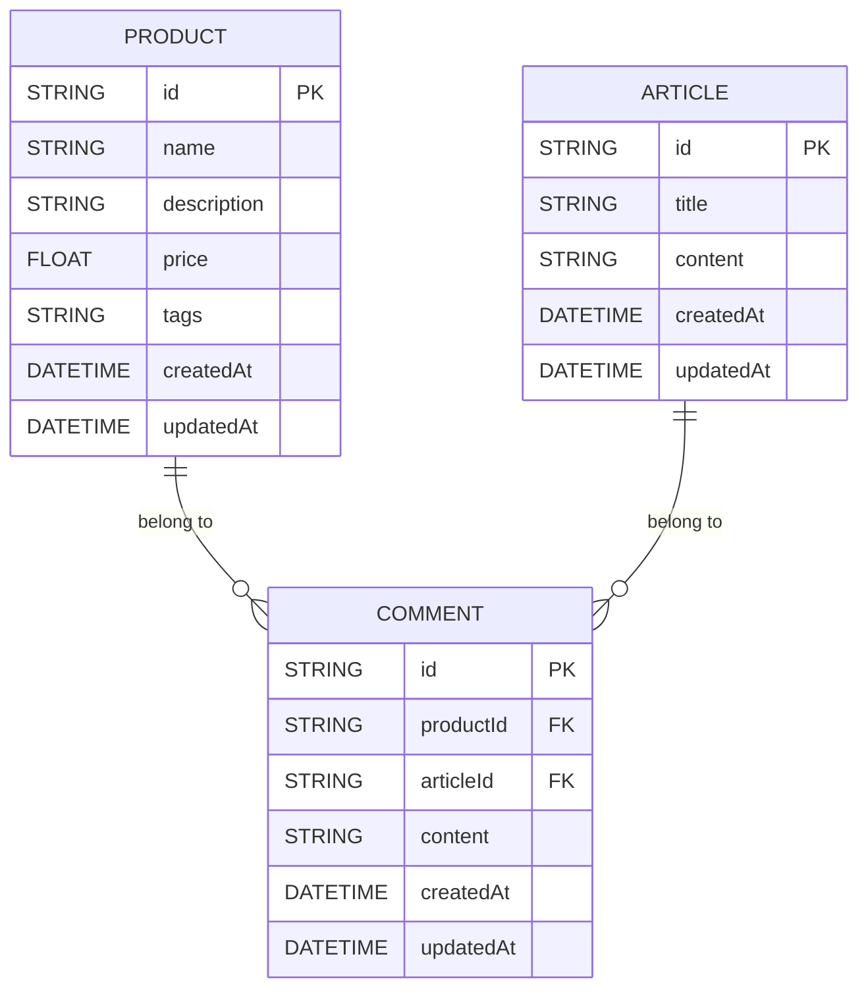

```mermaid
  erDiagram
  PRODUCT {
    STRING id PK
    STRING name
    STRING description
    FLOAT price
    STRING tags
    DATETIME createdAt
    DATETIME updatedAt
  }
  ARTICLE {
    STRING id PK
    STRING title
    STRING content
    DATETIME createdAt
    DATETIME updatedAt
  }
  COMMENT {
    STRING id PK
    STRING productId FK
    STRING articleId FK
    STRING content
    DATETIME createdAt
    DATETIME updatedAt
  }

PRODUCT ||--o{ COMMENT : "belong to"
ARTICLE ||--o{ COMMENT : "belong to"
```
