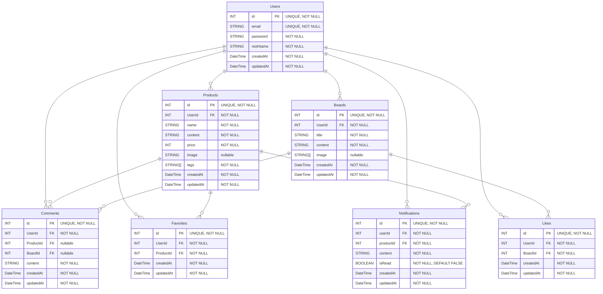

```mermaid
erDiagram

Users {
  INT id PK "UNIQUE, NOT NULL"
  STRING email "UNIQUE, NOT NULL"
  STRING password "NOT NULL"
  STRING nickName "NOT NULL"
  DateTime createdAt "NOT NULL"
  DateTime updatedAt "NOT NULL"
}

Products {
  INT id PK "UNIQUE, NOT NULL"
  INT UserId FK "NOT NULL"
  STRING name "NOT NULL"
  STRING content "NOT NULL"
  INT price "NOT NULL"
  STRING image "nullable"
  STRING[] tags "NOT NULL"
  DateTime createdAt "NOT NULL"
  DateTime updatedAt "NOT NULL"
}

Boards {
  INT id PK "UNIQUE, NOT NULL"
  INT UserId FK "NOT NULL"
  STRING title "NOT NULL"
  STRING content "NOT NULL"
  STRING[] image "nullable"
  DateTime createdAt "NOT NULL"
  DateTime updatedAt "NOT NULL"
}

Comments {
  INT id PK "UNIQUE, NOT NULL"
  INT UserId FK "NOT NULL"
  INT ProductId FK "nullable"
  INT BoardId FK "nullable"
  STRING content "NOT NULL"
  DateTime createdAt "NOT NULL"
  DateTime updatedAt "NOT NULL"
}

Likes {
INT id PK "UNIQUE, NOT NULL"
INT UserId FK "NOT NULL"
INT BoardId FK "NOT NULL"
DateTime createdAt "NOT NULL"
DateTime updatedAt "NOT NULL"
%%UNIQUE (userId, BoardId)
}

Favorites {
INT id PK "UNIQUE, NOT NULL"
INT UserId FK "NOT NULL"
INT ProductId FK "NOT NULL"
DateTime createdAt "NOT NULL"
DateTime updatedAt "NOT NULL"
%%UNIQUE (userId, ProductId)
}

Notifications	{
INT id PK "UNIQUE, NOT NULL"
INT userId FK "NOT NULL"
INT productId FK "NOT NULL"
STRING content "NOT NULL"
BOOLEAN isRead "NOT NULL, DEFAULT FALSE"
DateTime createdAt "NOT NULL"
DateTime updatedAt "NOT NULL"
}

  Users ||--o{ Products : ""
  Users ||--o{ Boards : ""
  Users ||--o{ Comments : ""
  Users ||--o{ Likes : ""
  Users ||--o{ Favorites : ""
  Users ||--o{ Notifications : ""

  Products ||--o{ Comments : ""
  Products ||--o{ Favorites : ""
  Products ||--o{ Notifications : ""

  Boards ||--o{ Comments : ""
  Boards ||--o{ Likes : ""

```
